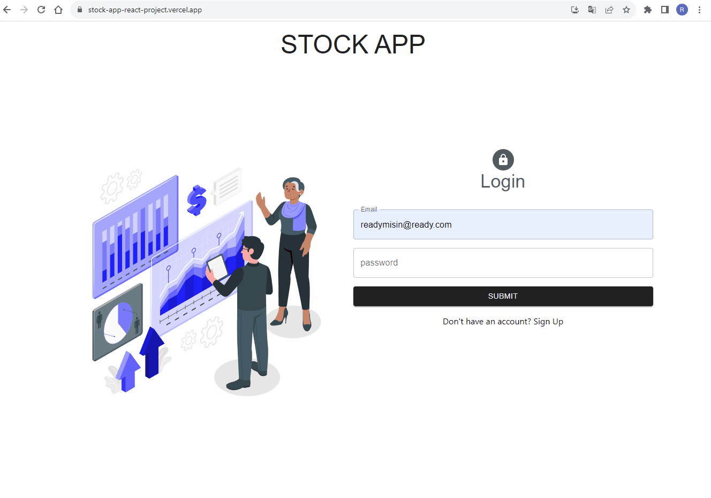

# Project Name: Stock App React Redux
<h3>Visit: https://stock-app-react-project.vercel.app/</h3>

# Stock Management System

## Overview
The Stock Management System is a web application designed to manage inventory and sales data. It provides a user-friendly interface for tracking sales, profits, brands, and firms. This README.md file provides an overview of the project's main components and functionalities.

## Dashboard
### Home Component
- The `Home.js` component serves as the dashboard's landing page.
- It displays key performance indicators (KPIs) using cards and charts.
- KPIs include sales, profits, and customer metrics.
- Data is fetched using the `useStockCall` hook when the component mounts.

### KpiCards Component
- The `KpiCards.js` component displays KPIs as cards on the dashboard.
- It dynamically updates KPI values when data changes.

### Charts Component
- The `Charts.js` component visualizes historical data using interactive charts.
- Users can analyze sales and profit trends over time.

## Inventory Management
### Brands Component
- The `Brands.js` component manages brand information.
- Users can view, add, and edit brand details.
- Brand data is fetched from the server using the `useStockCall` hook.
- Brand images can be uploaded when creating or editing a brand.

### Firms Component
- The `Firms.js` component handles firm data.
- It allows users to view, create, and edit firm information.
- Firm data is retrieved from the server using the `useStockCall` hook.
- The component features a modal for adding new firms.

## User Authentication
### Login Component
- The `Login.js` component provides a login interface.
- Users can access their accounts by entering their credentials.
- Form validation is implemented using Formik and Yup schemas.
- User authentication is handled by the `useAuthCall` hook.

### Register Component
- The `Register.js` component enables user registration.
- Users can create new accounts with their personal information.
- Form validation ensures data accuracy.
- Registration is handled by the `useAuthCall` hook.

## Shared Components and Libraries
- Material-UI: Material-UI is used for building the user interface and styling components.
- React: The project is built using the React library for creating reusable UI components.
- Redux: Redux is used for state management, but some code snippets related to Redux are commented out.
- Formik and Yup: Formik and Yup are used for form management and validation.
- Axios: Axios is used for making HTTP requests to the server.

## Overview
The Sales Dashboard project is a web application designed to visualize and manage sales data. It provides insights into sales, profits, and customer metrics. This README.md file provides an overview of the project's components and functionalities.

## Sales Component
The `Sales.js` component is responsible for displaying sales data. It retrieves data using the `useStockCall` hook and displays it in a table format. The component includes the following features:

- **New Sale Button**: Users can create new sales by clicking the "New Sale" button, which opens a modal for entering sale information.
- **Sale Modal**: The modal allows users to input sale details such as brand, product, quantity, and price.
- **Initialization**: The `useEffect` hook is used to fetch sales data when the component mounts.

## Performance Component
The `TremorChart.js` component is responsible for visualizing performance metrics. It uses the Tremor Chart library to display key performance indicators (KPIs) over time. The component includes the following features:

- **KPI Selection**: Users can switch between different KPIs (Sales, Profit, Customers) using tabs.
- **Area Chart**: The component displays an area chart that shows the selected KPI over time.
- **Responsive Design**: The chart is responsive and adjusts for different screen sizes.

## Data Formatting
The project includes functions for formatting data, such as currency formatting for sales and profit values.

## Data Source
The project uses data from an API, presumably related to sales and purchases. This data is used to populate the charts and tables.

## Components and Libraries
- React: The project is built using the React library for building user interfaces.
- Material-UI: Material-UI is used for styling and UI components.
- Tremor Chart: The Tremor Chart library is used for data visualization.
- Redux Toolkit: Redux Toolkit might be used for state management, but the code snippets related to Redux are currently commented out.

